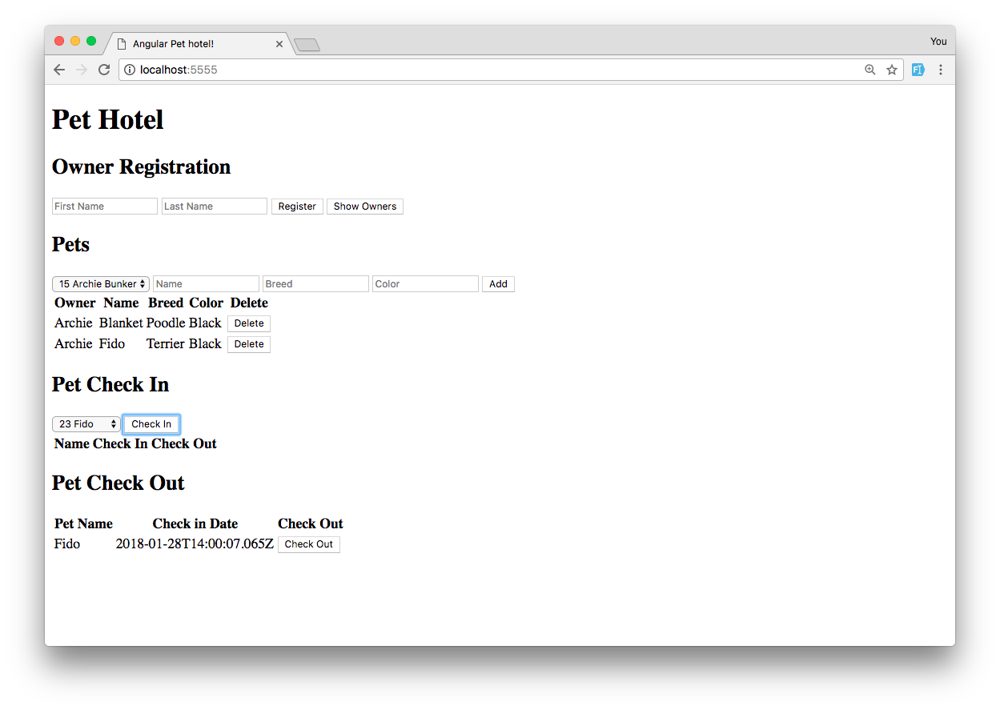

# Pet Hotel
Prime group project. CRUD app that allows user to add virtual pets that they can check in for a day at the spa. User first registers a new owner, then selects that owner and fills in data for a pet. The pet can then be checked-in and time-stamped. Focus on SQL join tables and constraints.

Originally written in jQuery, I refactored it to AngularJS. To use jQuery version, go to index.js line 5 and change to index.html (index2.html for Angular).

 

 

## Completed Features
- Add or delete an owner.
- Show all owners.
- Add or delete a pet.
- Check in/time-stamp a pet.
- Check out a pet.

## Features to add
- Styling.

### Technology Used
AngularJS, JavaScript, PostregSQL, Node.JS, Express.JS, HTML.